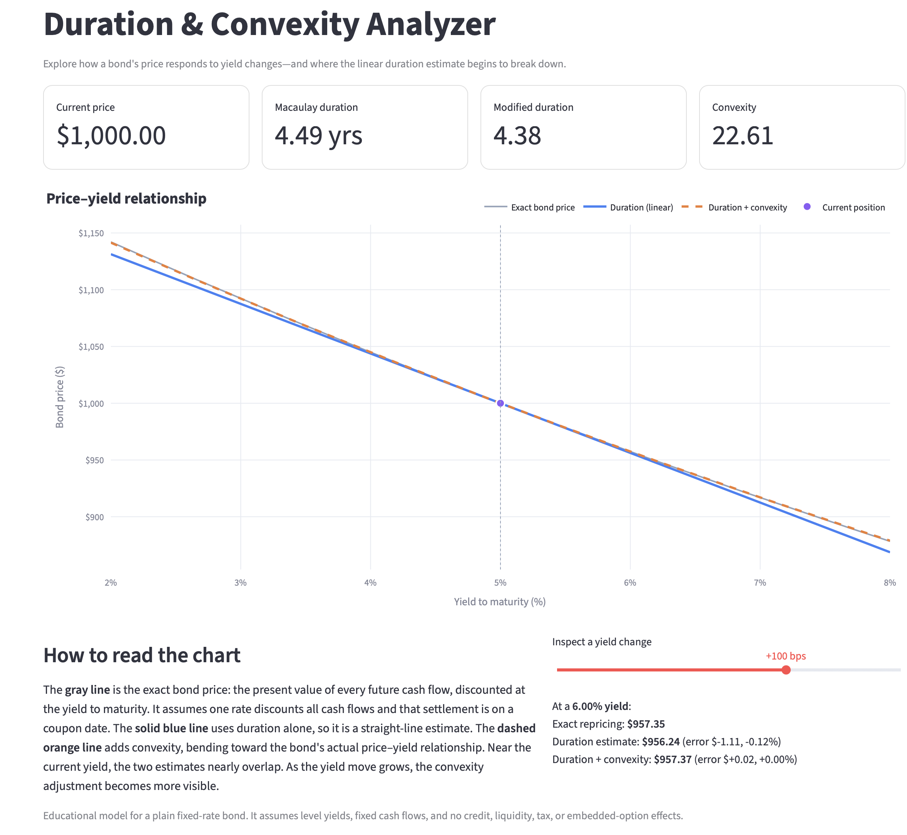

# Duration & Convexity Analyzer

An interactive Streamlit app for learning how duration and convexity
approximate a fixed-rate bond's price response to changes in yield.

## What this app shows

A bond's price is a convex, decreasing function of its yield. Duration is the
slope of the tangent line at the current yield — a first-order (linear)
approximation. Convexity is the curvature — a second-order correction that
bends the estimate toward the true price curve.

The app plots all three:

- the **exact price–yield curve** (present value of every cash flow),
- the **duration-only tangent line**, and
- the **duration-plus-convexity curve**,

so you can see where the linear estimate breaks down as yield moves grow.



The approximations come from the Taylor expansion of price in yield:

$$
\frac{\Delta P}{P} \approx -D_{\text{mod}} \, \Delta y + \tfrac{1}{2} C \, (\Delta y)^2
$$

where $D_{\text{mod}}$ is modified duration and $C$ is convexity.

## Modeling assumptions

This is an educational model of a plain fixed-rate bond. It assumes a level
yield curve (one rate discounts all cash flows), settlement on a coupon date,
fixed cash flows, and no credit, liquidity, tax, or embedded-option effects.

## Run locally

Clone the repository, enter its directory, and install the dependencies:

```shell
git clone https://github.com/colinlpaterson/duration-convexity-analyzer.git
cd duration-convexity-analyzer
python -m pip install -r requirements.txt
```

Start the app:

```shell
python -m streamlit run app.py
```

Streamlit will display the local URL in the terminal, typically
`http://localhost:8501`. Press `Ctrl+C` to stop the app.

## Using the app

The sidebar controls the bond terms, current yield, and chart range. Use the
scenario slider beneath the chart to compare both approximations with an exact
repricing at a specific yield.

## Run the tests

```shell
python -m pytest
```

## Deploy on Streamlit Community Cloud

1. Push this repository to GitHub.
2. Sign in to Streamlit Community Cloud and create a new app.
3. Select the repository and branch.
4. Set the entry-point file to `app.py`.
5. Deploy the app.
